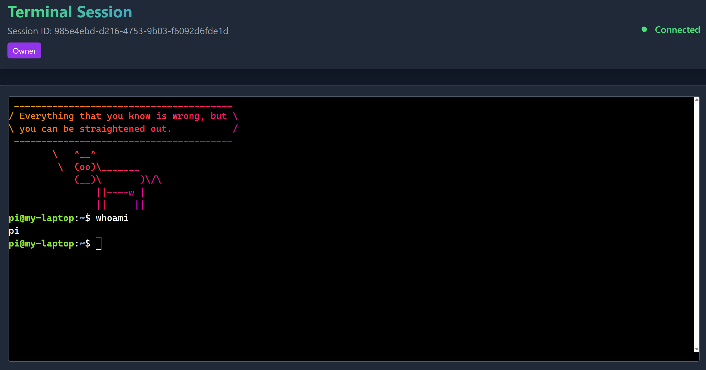
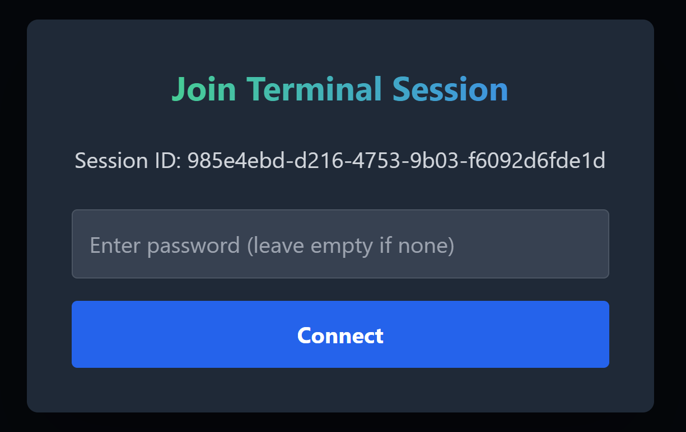
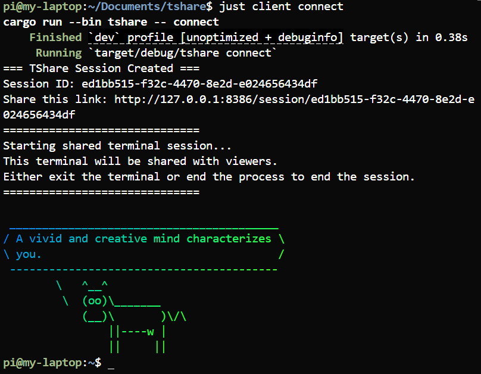

# TShare

[](https://opensource.org/licenses/MIT)
[](https://www.rust-lang.org)
[](https://github.com/RobbyV2/tshare)

[](https://www.rust-lang.org)

Collaborative terminal sharing.

## Screenshots

<div align="center">
  
  
  <br><br>
  
</div>

## Requirements

- Rust (any recent version)

Development dependencies:
- just (`cargo install just`)
- djlint (`pip install djlint`) for HTML formatting

## Installation

Download pre-built packages from the [releases page](https://github.com/RobbyV2/tshare/releases) or build from source:

```bash
cargo build --release
# Binaries will be in target/release/
```

## Usage

Start servers:
```bash
tshare tunnel &
tshare web &
```

Share terminal:
```bash
tshare connect
```

## Development

See `justfile` for available commands:
```bash
just --list
```

Common commands:
```bash
just run            # Start both servers
just client connect # Create session
just build          # Build release
just build-deb      # Build .deb package
```

## Architecture

- `tshare`: CLI client, captures terminal sessions
- `tshare tunnel`: WebSocket relay and API, port 8385
- `tshare web`: Web interface, port 8386

## Configuration

All binaries accept `--help` for options. Default configuration works for local development.

Production example:
```bash
tshare tunnel --host 0.0.0.0
tshare web --host 0.0.0.0 --tunnel-url http://tunnel.example.com:8385
tshare connect --tunnel-host tunnel.example.com --web-host web.example.com
```

## License

MIT